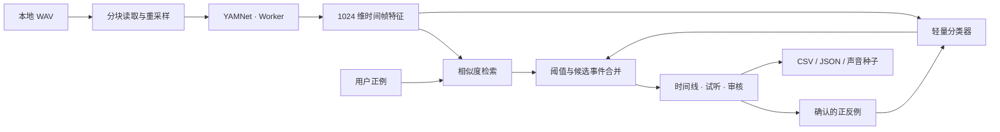

# SoundSeed v0.1 架构

SoundSeed 是一个 React + TypeScript + Vite 单页应用。所有分析都发生在浏览器内；静态服务只负责提供应用、模型和运行时文件。

## 音频进入模型之前

WAV 解析器读取 RIFF 头部与音频数据块，按需通过 `File.slice` 解码。它支持 PCM 8 / 16 / 24 / 32 位、IEEE float 32 / 64 位及相应的 extensible 格式。输入的多个声道混合为单声道，用带限重采样转换到模型需要的 16 kHz。

处理器以小批次向模型供给波形，而不是将一小时的完整 PCM 浮点数组一次性送入模型。波形概览另行降采样保留，用于绘制和选择区间。试听使用本地文件；文件不会发往模型服务器。

边界条件包括格式不支持、截断文件、无效元数据和过短输入。声道平均可能使反相立体声相互抵消；如果目标声音在混音后变弱，应先提供合适的单声道版本。

## 特征提取

预训练特征提取器使用 Google 官方 TensorFlow.js YAMNet 图模型，运行在独立 Worker 中。WASM 是首选后端，不能初始化时可回退到 CPU。首次准备模型的命令下载模型文件并将 TensorFlow.js WASM 运行时复制到本地静态目录。

YAMNet 的特征维度为 1024。分析帧约 0.96 秒、步长 0.48 秒；底层频谱处理需要额外的窗口上下文。帧时间戳对应其在原始录音中的秒数，尾帧结束时间限制在实际录音长度内。模型的 AudioSet 类别输出不决定用户可以搜索的目标；用户搜索基于特征及标注。

每小时约有 7500 个时间帧，仅原始 float32 特征就约 31 MB。分块处理降低了波形解码的峰值，但仍需要保留特征索引；这不是内存恒定的无限长度流式系统。

官方基础参数见 [YAMNet 说明](https://github.com/tensorflow/models/tree/master/research/audioset/yamnet) 和 [迁移学习教程](https://www.tensorflow.org/tutorials/audio/transfer_learning_audio)。

## 从样例到候选

1. 用户圈选的区间映射到对应的特征帧，并形成带正负标签的样例。
2. 只有正例时，系统进行相似度检索；多个正例可以表达同一声音的不同变化。特征归一化后，分数由最近正例的余弦相似度（90%）与正例中心的相似度（10%）组成。
3. 加入用户确认的反例后，用 L2 正则化、类别平衡的逻辑分类器重新学习区分边界。最终分数将相似度与分类器输出结合，计算为 `similarity × (0.3 + 0.7 × learnedScore)`。YAMNet 参数保持冻结。
4. 帧分数经过阈值筛选及相邻区间合并，形成便于试听的候选事件。修改阈值只需重新筛选特征分数，无需重新读取原始录音。
5. 审核优先级引导用户检查靠近决策边界的候选；它是交互启发式，不是对模型误差的保证。撤销操作会移除对应反馈并重新计算结果。

没有把未标注区间自动当作“确定的负例”。未标注的录音可能仍然包含用户想找的声音。

相似度分数和分类器分数都不是经过独立校准的概率。模型切换、样例变化和录音分布变化后，相同阈值也可能产生不同的候选数量。

## 声音种子与结果

录音身份使用分块 SHA-256 内容指纹（`wav-sha256tree-v1`），与文件名和修改时间无关。同一文件改名后仍会识别为相同来源，评估继续排除它的训练区间。该指纹是版本化的哈希树标识，不是标准整文件 SHA-256；每次最多额外读取 4 MiB。

声音种子保存搜索目标所需的特征样例及元数据，以便在另一段录音中复用；它不包含原始音频。录音来源信息用于区分当前文件中的教学区间与其他文件提供的样例。跨录音评估时，不应把其他文件中相同数字的时间戳排除掉。

CSV 适合带时间戳的后续审核。字段为 `recording`、`target`、`start_seconds`、`end_seconds`、`score` 和 `status`。`candidate` 表示尚待审核的模型候选；`confirmed` 表示用户确认的当前录音正例，其分数为空。导出同时保留这两类事件，已经确认的目标不会因为从待审列表移除而丢失。

JSON 保留相同事件、阈值、模型模式、样例元数据及评估结果。结果 JSON 不包含特征向量；如需在另一录音中复用目标，应另行保存声音种子。将文件分享到外部属于用户自己的操作，应用本身不自动上传。

第一版不提供多用户同步、云端项目、持久音频库、向量数据库或多目标同时检测。浏览器刷新会丢失当前内存会话；需要保留的结果和种子应导出为文件。

## 评估与信任边界

人工标注用于评估，不作为隐式训练输入。应用对候选事件与完整人工事件表进行一对一匹配，并排除当前文件中用户已经标注的教学区间。

同录音纠错的前后对比属于交互实验。跨日期、跨设备能力需要独立数据检验；代码测试、合成演示和人工真实录音评测分别回答不同的问题。具体指标与匹配规则见 [评估指南](evaluation.md)。

## 静态部署与网络

模型和 WASM 文件需要与应用同源提供。`pnpm setup:model` 是模型资源准备步骤，`pnpm build` 只构建已有资源，不会自动下载模型。CI 可以在无模型权重的环境下测试和构建源码，但这样的构建还不足以运行真实音频推理。

默认开发服务绑定到本机地址。本项目没有依赖第三方推理 API，也没有后端数据库。模型权重可以保存在浏览器 IndexedDB 缓存中，缓存失败不应妨碍从本地静态资源加载模型。应用未实现完整 Service Worker 离线缓存，因此“断网继续使用本地服务”与“安装后无需服务即可使用”是不同能力。

`pnpm build:release` 将已有的完整构建装入便携目录，并附带 Python 标准库静态服务和系统启动器。服务采用 `127.0.0.1:0`，由操作系统选择空闲端口；限定服务根目录为包内 `app/`，阻止目录列表与符号链接越界，只接受 GET / HEAD。它没有上传、训练或推理路由。由于每次端口可能不同，IndexedDB 缓存可能属于不同站点来源；本地模型文件保证不依赖缓存或外网。
